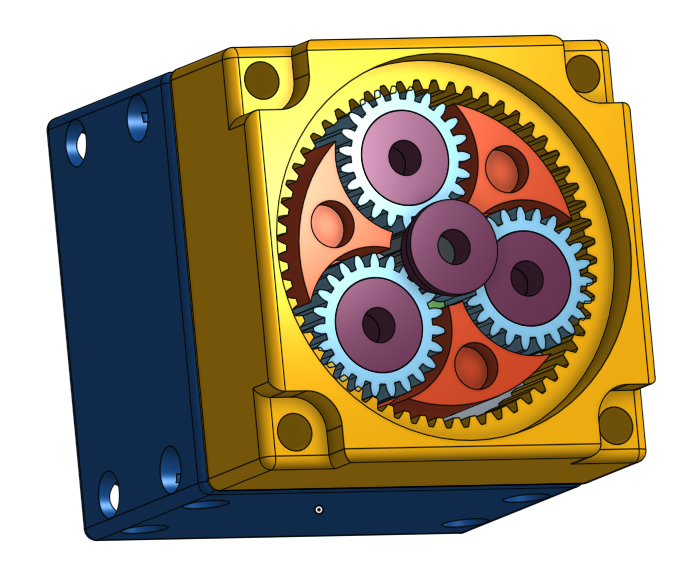
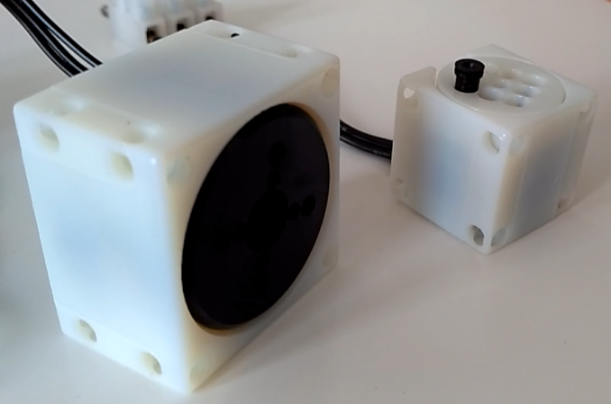
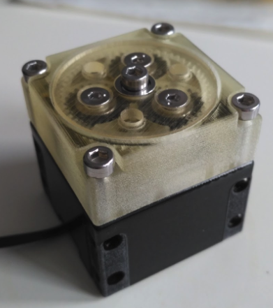
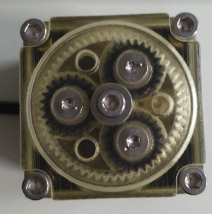

## Prototype of robotic actuators using Gimbal type brushless motors

The principle is to stack a reduction drive on top of a hobby type Gimbal motor.

### Design

The design of the prototype can be seen below.

The physically implemented prototype can be seen below.

### Videos

You can see the motor moving on the following videos:

- Test with load: https://www.youtube.com/watch?v=3FY4rBz61NA
- Test with reduction : https://www.youtube.com/watch?v=vXWYITwMOI0
- Test small motor, no reduction: https://www.youtube.com/watch?v=6wLVxOI6N2c

### Instructions

This prototype is open source, you can find:
- some code in the [software folder](software)
- the 3D models on onshape https://cad.onshape.com/documents/26e1909c6f1e552a80d9d2d5/w/e72389940fa15830bd8ad173/e/2e10214ff3de9594ee33cef7
- links to the components needed in the [docs folder](docs/bom.md)
